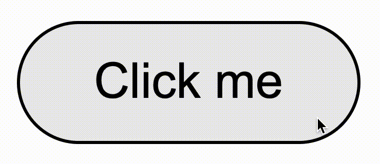

# Material Ripple Web

Material Ripple Web is a framework agnostic library for adding ripple effects to the web. Its implementation is based on the official [\<md-ripple\>] web component.

<div align="center">
    
</div>

- [Installation](#installation)
- [Usage](#usage)
- [Theming](#theming)
- [Framework Wrappers](#framework-wrappers)
    - [React](#react)
    - [Svelte](#svelte)

## Installation

Install the package from npm using your preferred package manager.

```bash
npm install material-ripple-web
pnpm add material-ripple-web
bun add material-ripple-web
yarn add material-ripple-web
```

## Usage

Include the stylesheet in the HTML.

```html
<link
    rel="stylesheet"
    href="./node-modules/material-ripple-web/dist/ripple.css"
/>
```

Place the ripple element in a `position: relative` container and attach the event listeners using the `Ripple` class.

```html
<button style="position: relative">
    <div id="ripple"></div>
    <span>Click me</span>
</button>
<script type="module">
    import { Ripple } from "./node-modules/material-ripple-web/dist/index.js";

    const rippleEl = document.getElementById("ripple");
    const ripple = new Ripple(rippleEl);
</script>
```

You can remove the attached event listeners by calling the `destroy` method.

```js
ripple.destroy();
```

You can also disabled the ripple by setting the `disabled` property to `true`.

```js
ripple.disabled = true;
```

## Theming

Ripples support theming using CSS variables.

| Token                      | Default        |
| -------------------------- | -------------- |
| `--ripple-hover-color`     | `currentColor` |
| `--ripple-hover-opacity`   | `0.08`         |
| `--ripple-pressed-color`   | `currentColor` |
| `--ripple-pressed-opacity` | `0.12`         |

## Framework Wrappers

Wrappers around the core API are available for React and Svelte.

### React

```tsx
import "material-ripple-web/ripple.css";
import { Ripple } from "material-ripple-web/react";
import { useState } from "react";

export function App() {
    const [disabled, setDisabled] = useState(false);
    return (
        <button style="position: relative">
            <Ripple disabled={disabled} />
            <span>Click me</span>
        </button>
    )
}
```

### Svelte

```svelte
<script>
    import "material-ripple-web/ripple.css";
    import { ripple } from "material-ripple-web/svelte";

    let disabled = false;
</script>

<button style="position: relative">
    <div use:ripple={{ disabled }} />
    <span>Click me</span>
</button>
```

[\<md-ripple\>]: https://github.com/material-components/material-web/blob/main/docs/components/ripple.md
[documentation]: https://svelte-material-ripple.vercel.app
